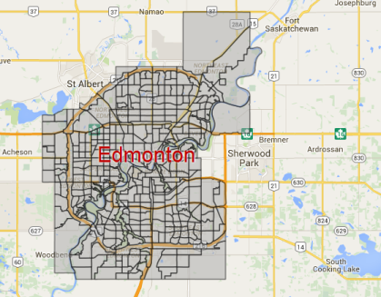
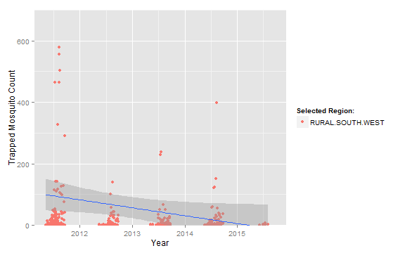

Edmonton Mosquito Trap Count App
========================================================
author: EdisonDev
date: September 26,2015
font-family: 'Helvetica'
transition: rotate


>


The Mosquito Trap Count App
========================================================


Has this ever happened to you?

- You move to a new region in Edmonton
- You have a barbecue outside
- Oh noes! Where did all the mosquitoes come from?


The App
========================================================
This App will tell you how many mosquitos were trapped in the area that you are considering.

More Mosquitos Trapped = More mosquitos present

The dataset was downloaded from [Edmonton Open Data](https://data.edmonton.ca/Environmental-Services/Mosquitoes-Trap-Data/5zeu-wkpv)

The .csv file was downloaded and imported via:


```r
dataf=read.csv("mosquitoes_trap_data.csv")
dataf$TRAP_DATE=strptime(dataf$TRAP_DATE, format="%B %d %Y")
```

Plotting Code
========================================================
The following code plots the counts in a region and fits a linear trend line.

```r
library(ggplot2) 
reg="RURAL.SOUTH.WEST" #Define the region
p <- ggplot()+
geom_point(data = dataf, 
                   aes(x = TRAP_DATE, y = get(reg[1]), color = reg[1]))+
  stat_smooth(data = dataf, method="lm",aes(x = TRAP_DATE, y = get(reg[1])))+
  coord_cartesian(ylim = c(0, 700))+
  ylab("Trapped Mosquito Count")+
  xlab("Year")+scale_colour_discrete(name = "Selected Region:")
p
```

Plotting Code Executed (Results)
===
A downward trend in the number of moquitos trapped indicates:
- Either there are fewer mosquitos year after year
- Or, the city has given up and is spending money elsewhere

